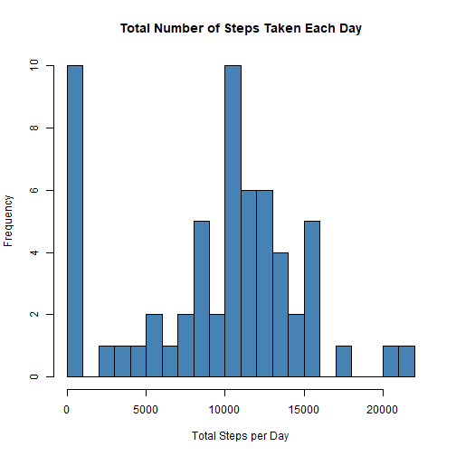
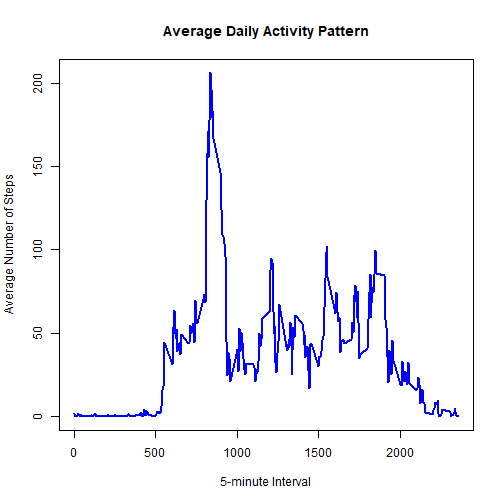
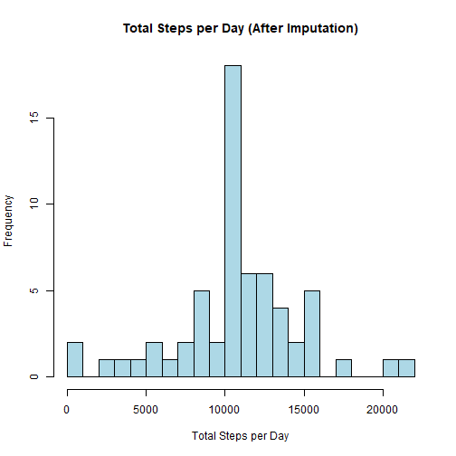
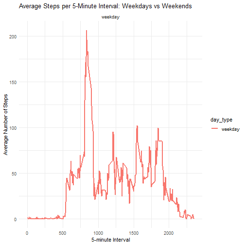

``` r
rm(list = ls(all.names = T))
getwd()
```

```
## [1] "C:/Users/kevin/Desktop/R Coursera/K5A1/m5a1"
```

``` r
# Load required packages
library("dplyr")

# Read the data
activity<-read.csv("C:/Users/kevin/Desktop/R Coursera/K5A1/repdata_data_activity/activity.csv")
# Convert 'date' to Date type
activity$date <- as.Date(activity$date, format = "%Y-%m-%d")

str(activity)
```

```
## 'data.frame':	17568 obs. of  3 variables:
##  $ steps   : int  NA NA NA NA NA NA NA NA NA NA ...
##  $ date    : Date, format:  ...
##  $ interval: int  0 5 10 15 20 25 30 35 40 45 ...
```

``` r
#Tot number of steps
##sum tot num of steps by day
steps_per_day <- activity %>%
  group_by(date) %>%
  summarise(total_steps = sum(steps, na.rm = TRUE))

head(steps_per_day)
```

```
## # A tibble: 6 × 2
##   date       total_steps
##   <date>           <int>
## 1 2012-10-01           0
## 2 2012-10-02         126
## 3 2012-10-03       11352
## 4 2012-10-04       12116
## 5 2012-10-05       13294
## 6 2012-10-06       15420
```

``` r
# Plot histogram of total steps per day
hist(steps_per_day$total_steps,
     main = "Total Number of Steps Taken Each Day",
     xlab = "Total Steps per Day",
     col = "steelblue",
     breaks = 20)
```



``` r
# Calculate mean and median of total steps per day
mean_steps <- mean(steps_per_day$total_steps)
median_steps <- median(steps_per_day$total_steps)

mean_steps
```

```
## [1] 9354.23
```

``` r
median_steps
```

```
## [1] 10395
```

``` r
#avg daily activity pattern

##avg number steps in 5 min intervall
average_steps_interval <- activity %>%
  group_by(interval) %>%
  summarise(mean_steps = mean(steps, na.rm = TRUE))

plot(average_steps_interval$interval,
     average_steps_interval$mean_steps,
     type = "l",
     col = "blue",
     lwd = 2,
     xlab = "5-minute Interval",
     ylab = "Average Number of Steps",
     main = "Average Daily Activity Pattern")
```



``` r
max_interval <- average_steps_interval[which.max(average_steps_interval$mean_steps), ]

max_interval
```

```
## # A tibble: 1 × 2
##   interval mean_steps
##      <int>      <dbl>
## 1      835       206.
```

``` r
#missing value

##tot number of mv
total_missing<- sum(is.na(activity$steps))
total_missing
```

```
## [1] 2304
```

``` r
##na replace with mean of 5 min intervall
activity_filled <- activity %>%
  left_join(average_steps_interval, by = "interval") %>%
  mutate(steps = ifelse(is.na(steps), mean_steps, steps)) %>%
  select(date, interval, steps)
## Check for any remaining NA values
sum(is.na(activity_filled$steps))
```

```
## [1] 0
```

``` r
## Calculate total steps per day with imputed data
steps_per_day_filled <- activity_filled %>%
  group_by(date) %>%
  summarise(total_steps = sum(steps))

## Plot histogram of total steps per day (after imputation)
hist(steps_per_day_filled$total_steps,
     main = "Total Steps per Day (After Imputation)",
     xlab = "Total Steps per Day",
     col = "lightblue",
     breaks = 20)
```



``` r
## mean and median again
mean_steps_filled <- mean(steps_per_day_filled$total_steps)
median_steps_filled <- median(steps_per_day_filled$total_steps)

mean_steps_filled
```

```
## [1] 10766.19
```

``` r
median_steps_filled
```

```
## [1] 10766.19
```

``` r
## Compare to original results
mean_diff <- mean_steps_filled - mean_steps
median_diff <- median_steps_filled - median_steps

mean_diff
```

```
## [1] 1411.959
```

``` r
median_diff
```

```
## [1] 371.1887
```

``` r
#differences in activity patterns between weekdays and weekends?

activity_filled$date <- as.Date(activity_filled$date)

# Now create the weekday/weekend variable again
activity_filled$day_type <- ifelse(weekdays(activity_filled$date) %in% c("Saturday", "Sunday"),
                                   "weekend", "weekday")

activity_filled$day_type <- as.factor(activity_filled$day_type)


##Create new factor variable: weekday or weekend
activity_filled$day_type <- ifelse(weekdays(activity_filled$date) %in% c("Saturday", "Sunday"),
                                   "weekend", "weekday")

activity_filled$day_type <- as.factor(activity_filled$day_type)

##Calculate average steps per interval by day type
avg_steps_daytype <- activity_filled %>%
  group_by(interval, day_type) %>%
  summarise(mean_steps = mean(steps), .groups = "drop")

##Plot: Compare weekday vs weekend activity patterns
library(ggplot2)

ggplot(avg_steps_daytype, aes(x = interval, y = mean_steps, color = day_type)) +
  geom_line(size = 1) +
  facet_wrap(~ day_type, ncol = 1) +
  labs(title = "Average Steps per 5-Minute Interval: Weekdays vs Weekends",
       x = "5-minute Interval",
       y = "Average Number of Steps") +
  theme_minimal()
```




